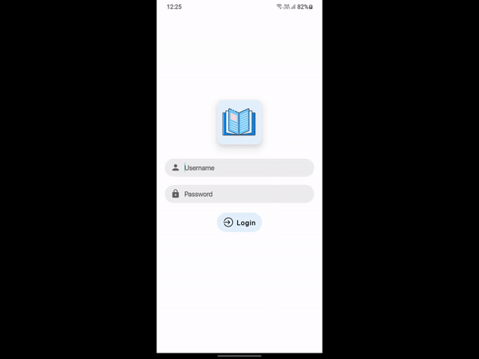

# MyLib - Library Management System

This repository is Android Application of MyLib Project. 
You can Find Back-end [Admin Panel Website](https://github.com/devarshukani/MyLib-AdminPanel) Code here

MyLib is Library Management System with Android Application to User side and Admin Panel Website for Library Management team.

## Features
- Login
- User Account
- Show Issued Book
- Search Books
- Category List
- Book Details & Availability

## Tools and Language Used
- Android Studio
- Java, XML & JSON 

## Application Preview

## Contributing
Pull requests are welcome.  
For major changes, please open an issue first to discuss what you would like to change.
